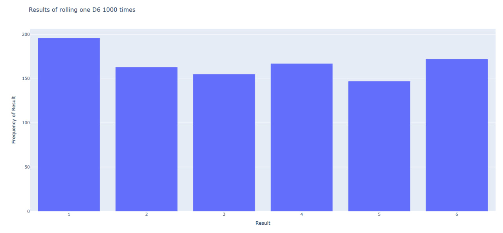
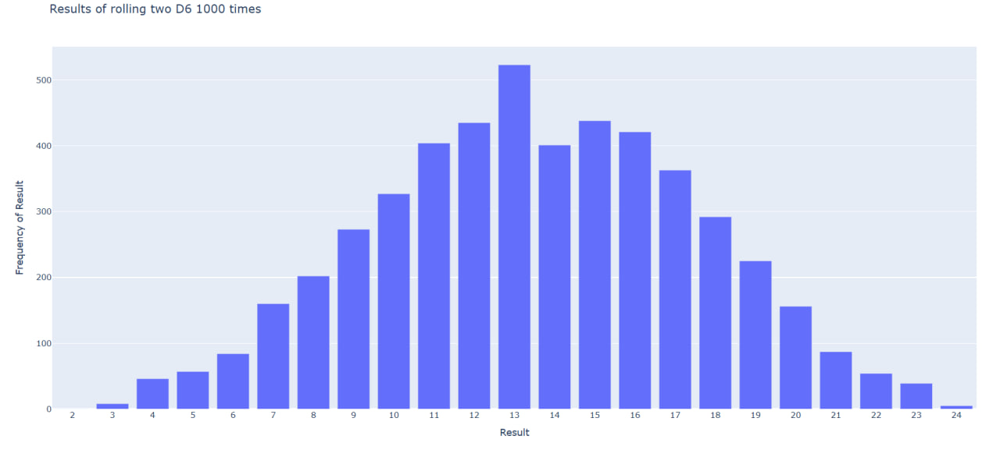

# Die Visual

Visualize dice roll results with Python and Plotly.

This folder contains a small project that simulates dice rolls and turns the results into interactive bar charts saved as HTML files.

## Table of Contents

- [Description](#description)
- [Features](#features)
- [Files](#files)
- [Requirements](#requirements)
- [Installation](#installation)
- [Usage](#usage)
- [Generated Output](#generated-output)
- [Project Structure](#project-structure)
- [Screenshot](#screenshot)
- [How It Works](#how-it-works)
- [Notes](#notes)

## Description

The project uses a reusable `Die` class to simulate random dice rolls. The visualization scripts collect the roll results, count how often each outcome appears, and create Plotly bar charts that can be opened in a browser.

This is a good beginner project for learning:

- object-oriented Python
- random number generation
- frequency counting
- interactive visualization with Plotly

## Features

- Simulates dice rolls with a reusable `Die` class
- Creates frequency distributions from random results
- Visualizes outcomes as interactive bar charts
- Exports charts as HTML files
- Includes multiple roll scenarios in separate scripts

## Files

### `die.py`

Defines the `Die` class.

Responsibilities:

- stores the number of sides on a die
- returns a random roll value between `1` and `num_sides`

### `die_visual.py`

Simulates rolling one standard six-sided die `1000` times and creates a Plotly chart.

Generated file:

- `d6.html`

### `die_visual3(8).py`

Simulates rolling three eight-sided dice `5000` times and creates a Plotly chart.

Generated file:

- `d6_d6.html`

## Requirements

- Python 3
- `plotly`

Install the dependency with:

```bash
pip install plotly
```

## Installation

Clone your repository and move into the project folder:

```bash
git clone <https://github.com/samiZZZ67/Small-projects.git>
cd <die visual>
```

Then move into this folder:

```bash
cd "die visual"
```

## Usage

Run the single-die visualization:

```bash
python die_visual.py
```

Run the three-dice visualization:

```bash
python die_visual36.py
```

After running either script, Plotly generates an HTML file that you can open in your browser.

## Generated Output

Running `die_visual.py` creates:

```text
d6.html
```

Running `die_visual36.py` creates:

```text
d6_d6.html
```

## Project Structure

```text
die visual/
|-- die.py
|-- die_visual.py
|-- die_visual36.py
`-- README.md
```

## Screenshot

<details>
<summary>Click to add or show screenshots</summary>

```md



```

</details>

## How It Works

1. A `Die` object is created with a chosen number of sides.
2. The script rolls the die or dice many times.
3. Each result is stored in a list.
4. The script counts the frequency of each possible outcome.
5. Plotly builds a bar chart from those frequencies.
6. The chart is saved as an HTML file.

## Notes

- `die_visual.py` uses one six-sided die.
- `die_visual3(8).py` currently rolls three eight-sided dice.
- The HTML files are generated output, so you can choose whether to commit them or regenerate them when needed.
